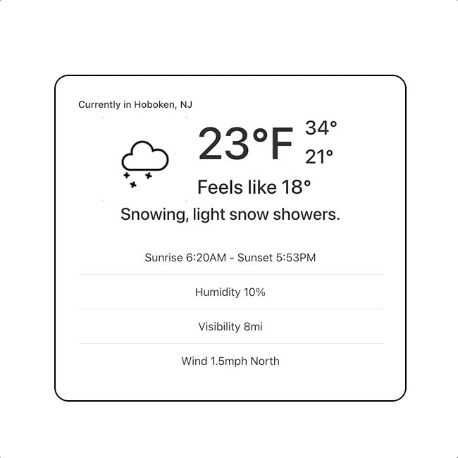

# WeatherFlash
### The one stop site to get your weather in a flash 




## Development
First, run the development server:
```bash
yarn dev
```
Open [http://localhost:3000](http://localhost:3000) with your browser to see the result.

